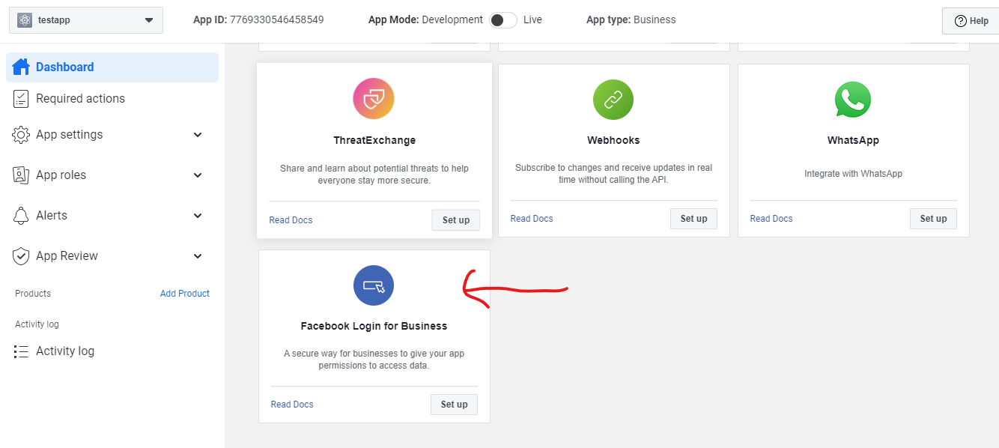

# Step-by-Step Guide: How to setup Meta WhatSapp API to manage WhatSapp Business Accounts (WABA) mostly for automation

## welcome to a short tutorial where i will walk you through how to set up meta buinsess login to onboard users of meta social media users specifically WhatSapp for long lived access to manage thier account their account re-authentication. i will also setup whatsapp web-hooks to recieve events, and expose you to other whatsapp endpoints for your various needs and use cases

### periquisite
 - code edidtor: vscode integrated termial (preferred)
 - typescript/nodejs: basic to intermidiate knowledge
 - react/nextjs: basic knowledge, will only be use to onboard Meta users (whatsapp).
### agenda
 - create Meta developer account: this is your normal facebook account
 - create Meta business portfolio: Meta business business for managing your business on Meta, integrated with all of meta's products like whatsapp, facebook-page, instagram etc.
 - create a business app: we will create an app in your developer portal.
 - setup Facebook Business Login for WhatSapp  
 <i> don't be confused with the name Facebook Business Login as this Meta product on the developer portal can be used to onboard users from Meta placeforms e.g whatsapp, instagram etc</i>. 
  - setup whatsapp webhook: to receive messages and notifications in real time.
 - test whatsapp coud api endpoints: test the Meta managed cloud api endpoints for whatsapp.

 ## Create a Meta Business Portfolio
1. register/login to to your normal facebook account.
2. open a new tap on your browser and enter https://business.facebook.com/
3. you should now be on the business manager home page, create a new business portfolio.
 - if you have at least one business portfolio already click the dropdown icon on the business name at the sidebar, then click on create a business business portfolio to create a new businsess portfolio.
 - if your account is fresh you will have the button in front of you to create a business portfolio. 
 regardless of where the button is, find it and create a new business portfolio.
 

 ## Create a Meta Developer Account
 ensure you are logged in to your normal facebook account and navigate to https://developers.facebook.com/ to create a meta developer account. your normal facebook account will be automatically used as your meta developer account.

 ## Create a business App on the developer portal
 1. navigate to the Meta developer portal: https://developers.facebook.com/
 2. click on my Apps 
 3. click on create app to create a new business app
 4. on the page(What do you want your app to do?) choose `Others` and click next.
 5. on the page(Select an app type) choose `Business` and click next 
 6. enter the name of the app (any name of your choosing) and contact email.
 optionally you can choose the business portfolio you create earlier and click save. your screen should look like the one below, if its not click on the app you just created. 

 

 7. click on app settings/basic
 8. copy app ID and app Secret to your `.env`. on the appDomain use localhost because the app in in development mode.
 9. scroll down to verify business, choose you business portfolio(if not already choosen) click on start verification.

## setup Whatsapp product on the developer portal
1. on the sidebar click add product, scroll down and locate whatsapp and click setup
2. complete the Become a Tech Provider onboarding process(get it to integration at most)
 

 ## Setup Facebook Business Login for WhatSapp.
 1. on the sidebar click add product, scroll down and locate Facebook Login For Business and click setup
 
 
 2. on the sidebar under facebook login for business click configurations.
 3. click on create configuration.
 4. give the config a name
 5. choose whatsapp embedded signup
 6. choose access token: System-user access token 
 7. Choose permissions: whatsapp_business_management and whatsapp_business_messaging.
 8. click save and copy the configuration code.

