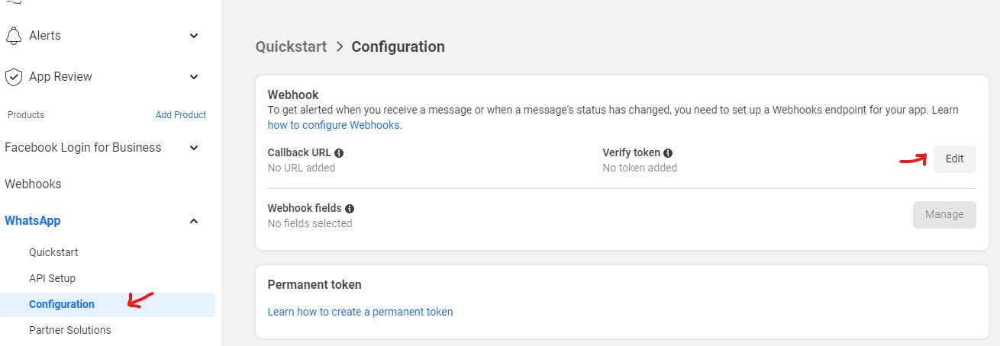
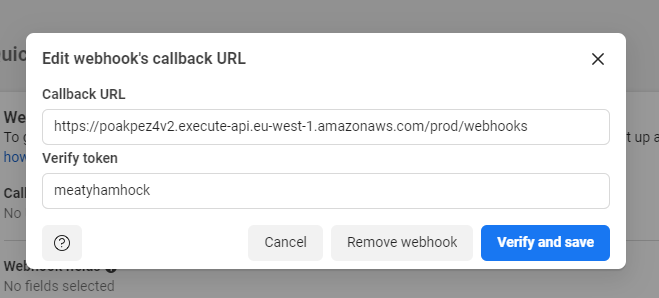
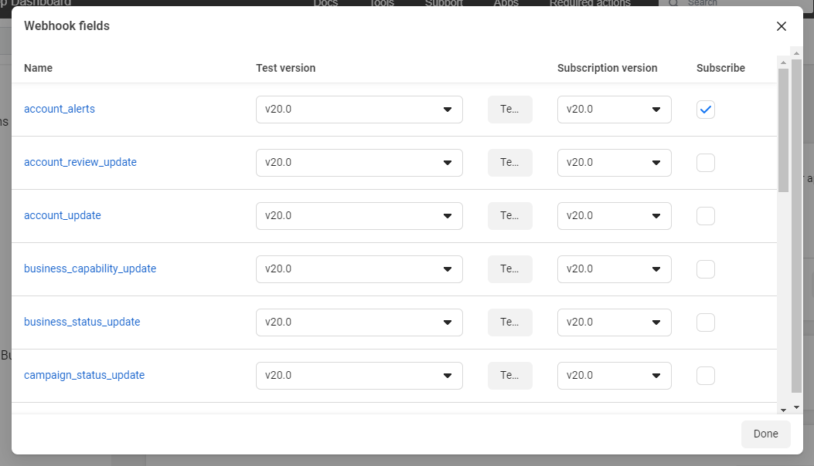
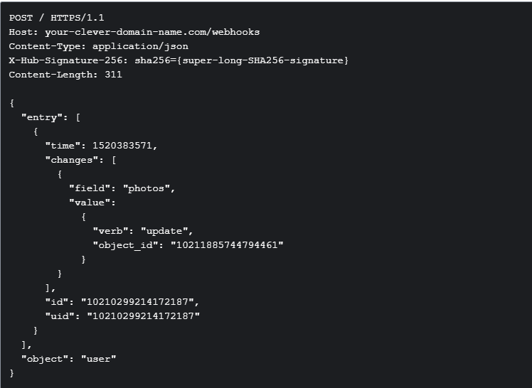

# Step-by-Step Guide: How to Set Up Meta WhatsApp API to Manage WhatsApp Business Accounts (WABA) - Part Two

## Welcome back to PART TWO of the tutorial where I will walk you through how to onboard WhatsApp Business Accounts, set up WhatsApp webhooks to receive events and expose you to other WhatsApp endpoints for various needs and use cases.

## note: this tutorial focuses on app that will be used by other businesses, so we are using the Get Started for Tech Providers or Get Started for Solution Partners guides.

## incase you missed part one here is the link for your reference

### Prerequisites

- **Code Editor**: VS Code integrated terminal (preferred)
- **TypeScript/Node.js**: Basic to intermediate knowledge
- **React/Next.js**: Basic knowledge, will only be used to onboard Meta users (WhatsApp)

### Agenda

- **Onboard WhatsApp Business Account**: This is a sigup process to which you get access to the users whatsapp credentials with which you will use to parform actions on behalf of the user.
- **Send whatsapp messages**: send messages on behalf of the user
- **Set-up WhatsApp Webhooks**: here we will setup webhook to listen for incoming messages, and other account activities
- **Explore other whatsapp endpoints**: we will explore other enpoints available for different usecase.

## Onboard WhatsApp Business Account

1. in the previous section [Part One](https://www.linkedin.com/pulse/step-by-step-guide-how-set-up-meta-whatsapp-api-manage-samuel-ronick-w6gvf/?trackingId=FAuKfd6bSaCs372AQsJbdg%3D%3D), we created a configurationId for whatsapp login use the facebook business login App on the developer portal, keep the id safe, if you dont have it checkout [Part One](https://www.linkedin.com/pulse/step-by-step-guide-how-set-up-meta-whatsapp-api-manage-samuel-ronick-w6gvf/?trackingId=FAuKfd6bSaCs372AQsJbdg%3D%3D), to learn how to create it.
2. On the developer portal copy `AppId` and `AppSecret` to a safe place.
   
3. create a new nextjs project (`npx create-next-app@latest`)
4. add you configuration keys in `.env.local`

```
META_APP_ID=XXXXXXXXXXXXXXXXXXXXXXXXXX
META_APP_SECRET=XXXXXXXXXXXXXXXXXXXXXXXXXX
META_APP_WHATSAPP_AUTH_CONFIG=XXXXXXXXXXXXXXXXX
```

5. Create a folder `sever_actions` in the app directory

```
<!--sever_actions/whatsapp  -->

"use server";
import queryString from "query-string";
import { redirect } from "next/navigation";

const AppId = getEnv("META_APP_ID");
const AppSecret = getEnv("META_APP_SECRET");

const whatSappLogin = (redirectUrl = "http://localhost:3000/") => {
    const configId = getEnv("META_APP_WHATSAPP_AUTH_CONFIG");
    const urlParams = queryString.stringify({
      client_id: AppId,
      config_id: configId,
      response_type: "code",
      override_default_response_type: true,
      redirect_uri: redirectUrl,
    });

    const url = `https://www.facebook.com/v18.0/dialog/oauth?${urlParams}`;
    return redirect(url)
};

  exchangeCodeForAccessToken = async ({
    code,
    redirect_uri = "http://localhost:3000/",
  }: WhatSappLoginInput) => {
    const params = {
      client_id: AppId,
      client_secret: AppSecret,
      redirect_uri,
      code,
    };
    const encoded = new URLSearchParams(params);
    const url = `https://graph.facebook.com/v18.0/oauth/access_token?${encoded.toString()}`;
    const res = await fetch(url);

    if (!res.ok) {
      const errorData: any = await res.json();
      throw new Error(`Error ${res.status}: ${errorData.error}`);
    }

    const data = await res.json();
    return data as { access_token: string; token_type: string };
  };
```

6. create login component

```
<!-- app/components/whatsapp/index.tsx -->

"use client";

import { whatSappLogin } from "../../server_actions/whatsapp";

export const WhatSappLoginButton = () => {
  const handleLogin = () => {
    whatSappLogin();
  };
  return <button onClick={handleLogin}>login to whatsapp</button>;
};

```

7. **use login Component on the page**: when you click the button, you are redirected to mata login for whatsapp signup flow, on success a code will be return to the redirect url via urlQueryParams `localhost:3000/?code="xxxxxxxxxxxxxxxxxx"` extract the code and pass it to `exchangeCodeForAccessToken` method to get `access_token`. save access_token to a secure db

```
<!-- app/page.tsx -->
  import {exchangeCodeForAccessToken} from "../server_actions/whatsapp
    const getCode = async ({code, error}) => {
      if(code){
          const data = await exchangeCodeForAccessToken(code)
          db.add(data)
      }
      if(error) throw new Error("whatsapp onboarding process failed")
    }

export default async function Page({searchParams}){
  await getCode(searchParams)
    return (
        <main>
            <WhatSappLoginButton />
        </main>)
    }
```

8. register the phone number: we need to register the phone number for it to be fully connected. `whatsappId` get whatsapp id from the onboarded user in [Meta Business Suit](https://business.facebook.com/) navigate to accounts, click whatsappAccounts. save the phoneNumber payload to your database.


```
const registerPhoneNumber = async (
    data: Pick<WhatSappAccount, "accessToken" | "whatsappId">
  ) => {
    const url = `https://graph.facebook.com/v20.0/${data.whatsappId}/phone_numbers`;
    const res = await fetch(url, {
      method: "get",
      headers: {
        Authorization: `Bearer ${data.accessToken}`,
      },
    });

    if (!res.ok) {
      const errorData: any = await res.json();
      throw new Error(`Error ${res.status}: ${errorData.error.message}`);
    }

    const phone_numbers = (await res.json()) as any;
    if (!phone_numbers.data)
      throw new Error("no phone number was found in your whatsapp account");
    const phone_number = phone_numbers.data[0] as {
      id: string;
      verified_name: string;
      code_verification_status: string;
      display_phone_number: string;
    };


    const MFAPIN = "005500";
    const registrationUrl = `https://graph.facebook.com/v20.0/${phone_number.id}/register`;
    const res = await fetch(registrationUrl, {
      method: "post",
      headers: {
        Authorization: `Bearer ${whatsappData.accessToken}`,
        "Content-Type": "application/json",
      },
      body: JSON.stringify({
        messaging_product: "whatsapp",
        pin: MFAPIN,
      }),
    });
    if (!res.ok) {
      const errorData: any = await res.json();
      throw new Error(`Error ${res.status}: ${errorData.error.message}`);
    }
  };
```

## send a whatsapp message using the registered phone number, replace `xxxxxxxxxxxxxx` with the recipiant phoneNumber.

    `whatsapp` in the code below represent the dataStorage for our onboarded whatsappUser. when we registered the phoneNumber the response payload was save there as well.

```
sendTestMessage = async (_id: string) => {
    const whatsapp = (await WhatSappAccountEntry.findById(
      _id
    )) as WhatSappAccount;
    const phoneNumberId = whatsapp.phoneNumber.id;
    if (!whatsapp.phoneNumber.isRegistered)
      throw new Error("phone number is not reqistered");

    const url = `https://graph.facebook.com/v20.0/${phoneNumberId}/messages`;
    const res = await fetch(url, {
      method: "post",
      headers: {
        Authorization: `Bearer ${whatsapp.accessToken}`,
        "Content-Type": "application/json",
      },
      body: JSON.stringify({
        messaging_product: "whatsapp",
        to: "xxxxxxxxxxxxxxxx",
        text: { body: "sammy the code finally worked" },
      }),
    });

    if (!res.ok) {
      const errorData: any = await res.json();
      throw new Error(`Error ${res.status}: ${errorData.error.message}`);
    }

    console.log("====================================");
    console.log(await res.json());
    console.log("====================================");
  };

```

## Set-up WhatsApp Webhooks:

Before you can start receiving notifications, you will need to create an endpoint on your server to receive them.

Your endpoint must be able to process two types of HTTPS requests: Verification Requests and Event Notifications. Since both requests use HTTPS, your server must have a valid TLS or SSL certificate correctly configured and installed. Self-signed certificates are not supported.


1. Set up a new project for the WhatsApp webhook and install Express and CORS. Create a src directory, and within it, create an app.ts file:


```
<!-- src/app.ts -->

import "dotenv/config";
import express from "express";
import cors from "cors";
import { whatsappWebhook } from "./helpers/webhook";

export const app = express();
app.use(cors({ origin: true, credentials: true }));
app.use(express.json());

app.get("/api", async (req, res) => {
  res.status(200).json({
    data: `api working pafectly`,
  });
});

app.all("/webhooks", whatsappWebhook);

const PORT = 5000;
app.listen(PORT, () => console.log("server running on port:", PORT));
```

2. Create a route handler for whatsappWebhook. Choose a token value to validate requests to the endpoint from WhatsApp. In our case, we chose meatyhamhock. Extract the token from the incoming request query parameters hub.verify_token. Also extract the following: hub.challenge and hub.mode. You are to respond with the challenge to complete the verification process of the webhook endpoint. mode is always set to subscribe.

```
<!-- src//helpers/webhook.ts -->

import { Response, Request } from "express";

export const whatsappWebhook = async (req: Request, res: Response) => {
  try {
    const mode = req.query["hub.mode"] === "subscribe";
    const challenge = req.query["hub.challenge"];
    const token = req.query["hub.verify_token"];
    const VERIFY_TOKEN = "meatyhamhock";

    // Check if the mode and token are correct
    if (mode && token === VERIFY_TOKEN) {
      // Respond with the challenge token from the request
      console.log(`Webhook verified: ${challenge}`);
      res.status(200).send(challenge);
    } else {
      // Respond with 403 Forbidden if tokens do not match
      res.status(403).send('Forbidden');
    }

  } catch (error: any) {
    console.error(error);
  }
};
```
3. Deploy the codebase and copy the webhook API endpoint. On your Meta developer dashboard, click the product WhatsApp/configuration, then click on edit.

Enter your endpoint URL and the token used in your codebase (for us, it's meatyhamhock). Click verify and save.




4. click manage on webhook fields to manage the fields event you want to subscribe to. Whenever there's a change to one of these fields, meta will send your endpoint a POST request with a JSON payload describing the change.



For example, if you subscribed to the user object's photos field and one of your app's Users posted a Photo, we would send you a POST request that would look something like this:



you can have a logic in your codebase to handle payload from each field.


## Conclusion
Congratulations! You've successfully set up the Meta WhatsApp API to manage WhatsApp Business Accounts (WABA) and created a comprehensive system for onboarding users, handling messages, and setting up webhooks. By following this guide, you've learned how to:

Onboard WhatsApp Business Accounts to manage user credentials and perform actions on their behalf.
Send WhatsApp messages using registered phone numbers.
Set up webhooks to listen for incoming messages and other account activities.
Explore various WhatsApp endpoints for different use cases.
This setup is particularly beneficial for applications designed to be used by other businesses, leveraging the Meta platform to enhance their communication capabilities. As you continue to develop your application, remember to keep your API keys and tokens secure and handle user data responsibly.

If you missed [Part One](https://www.linkedin.com/pulse/step-by-step-guide-how-set-up-meta-whatsapp-api-manage-samuel-ronick-w6gvf/?trackingId=FAuKfd6bSaCs372AQsJbdg%3D%3D), make sure to check it out for the foundational steps. Stay tuned for more advanced tutorials and best practices on integrating and utilizing the Meta WhatsApp API.

Happy coding!